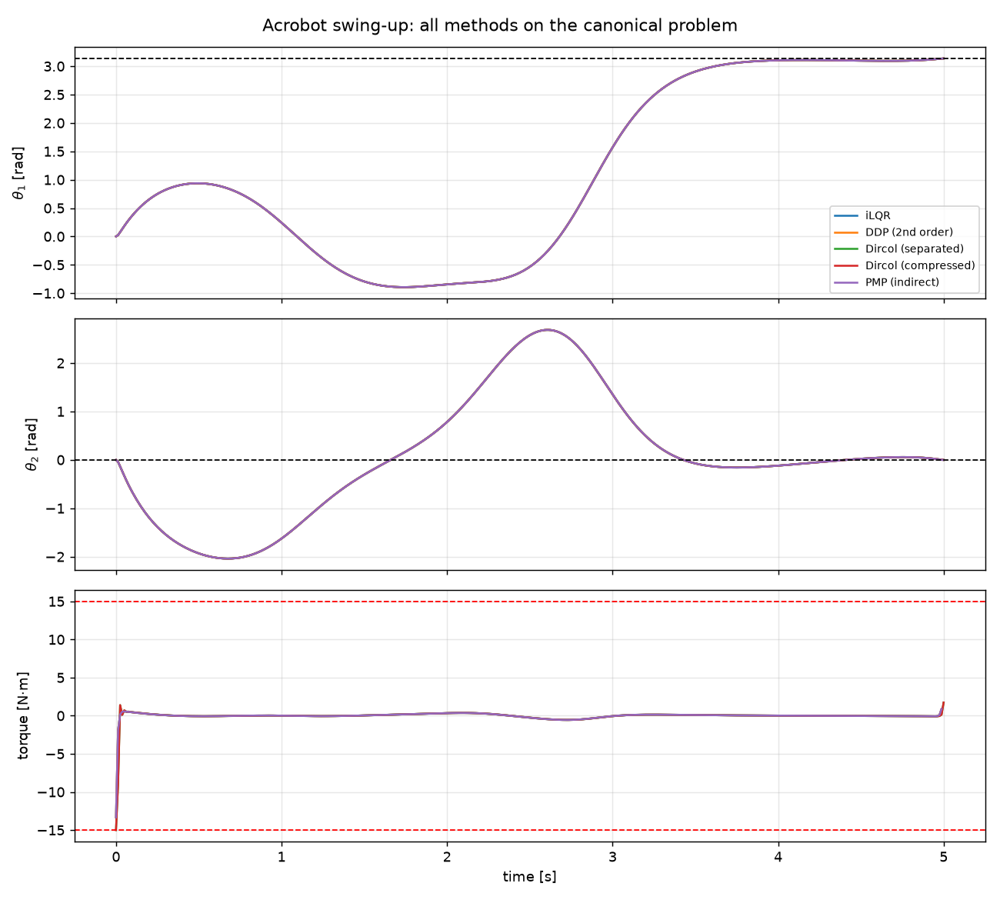

# Nonlinear trajectory optimization algorithms
This repo contains implementations of trajectory optimization methods applied to the acrobot swing-up, with a shared dynamics model and a common referee for comparing them on equal terms.
| method | file | family | backend |
|---|---|---|---|
| iLQR / DDP | [`ilqr_ddp.py`](ilqr_ddp.py) | shooting / dynamic programming | JAX |
| Direct collocation | [`dircol.py`](dircol.py) | direct transcription (Hermite–Simpson) | CasADi + IPOPT |
| PMP (indirect) | [`pmp.py`](pmp.py) | necessary conditions / indirect | JAX |
| Compare | [`compare.py`](compare.py) | runs all of them side by side | — |

All four land on the same trajectory: 

